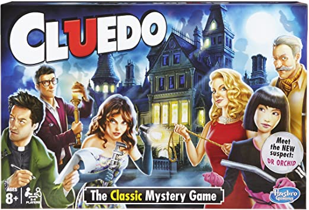
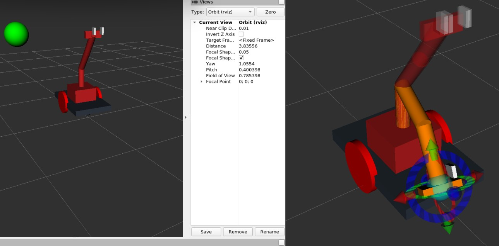
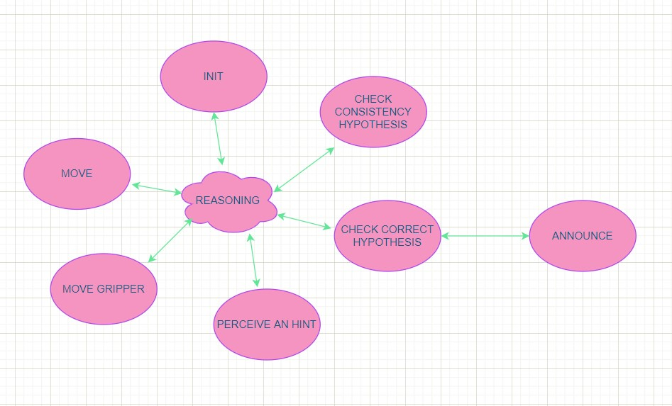
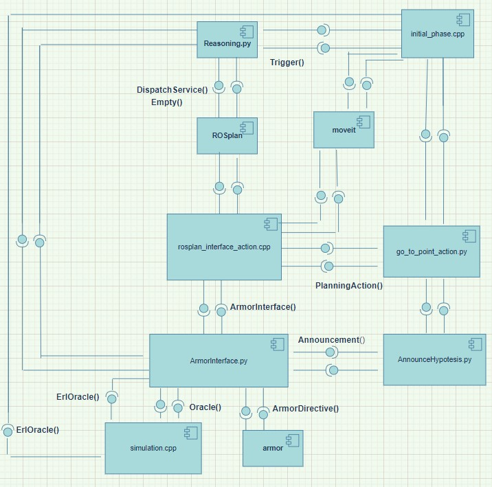
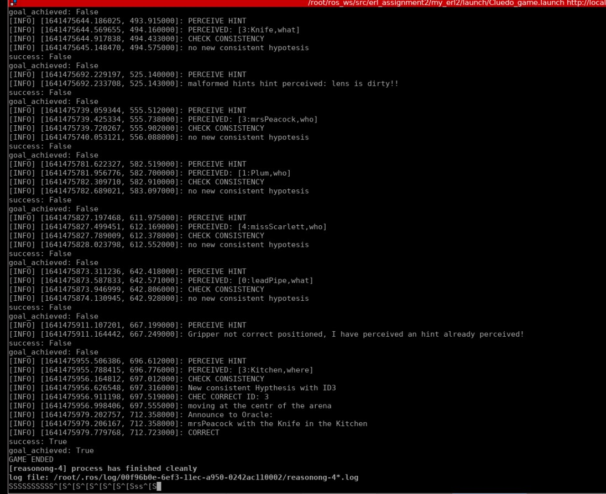

# Experimental Robotics Laboratory - Assignment2

The assignment consists in developping a software architecture to simulate an autonomous Cluedo game. The robot should explore an arena, looking for hints which are generated in established locations, reaching the locations with the robotic arm, reasoning about the hints through an ontology and finding the solution of the game. The best actions that robot must perform are selected through a pddl planning system.

## Software Architecture

### Robot Model

The robot model is visible in the image above. It has been  developped in the **sherlock_robot.gazebo** and **sherlock_robot.xacro** files in the urdf folder. The only constraint is reaching the height of 0.75 and 1.25 which is the height where hint are located. In order to control the arm and reach the hints the are is controlled through an ad-oc generated moveit package **moveit_assignment** foundable in the repository. The final .urdf file used is **sherlock_robot_moveit.urdf**.
Moreover the robot has a derivative controller to move in the environment and it is equipped of both laser and camera. 

### Robot behavior and Rosplan

The robot can perform different actions:
* move around
* move the gripper
* perceive an hint
* check the consistency of an hypothesis
* check if an hypotesis is correct 

Each action represent a specific state of the robot. 
The sequence in which the actions are performed is the one generated as plan by the ROSplan system. The transistions between the different states is menaged by the dispatcher.
In the state diagram all these state are represented, morever has been inserted another state which is the initial state of the robot, and the announce state which is a substate of the Check correct state. All the central state are connected by the reasoning module which is composed by the **ROSplan** or the **Reasoning.py** which is specified above.
In the **common** folder have been defined the pddl problem and domain which are respectively **cluedo_plan_nohint.pddl** and the **cluedo_domain_nohint.pddl**. The **plan.pddl** and **cluedo_plan_nohint.pddl**
are generated and updated when code is running.
The domain file three different types have been defined: robot, hypothesis and location.
In the domain file for each state of the robot a durative action has been defined: **move**, **move_gripper**, **perceive_hint**, **check_consistency**, **check_correct**. Moreover the action **new_turn** has been used to make the robot to visit again all the wayppoints after a turn of navigation has been completed.
The durative actions are used to menage the following predicates:
* **visited** , **non_visited** are used to managed the navigation between locations.
* **not_initial_location** is used to menage differently the location (0,0) and the waypoints.
* **at** is a predicate to state the actual location of the problem.
* **move_performed** is a predicate used to move the robot's arm only once it has changed location
* **gripper_positioned** is a predicate used to state that the gripper has been correctly moved, and the hint can be perceived only after that. Whereas **not_gripper_positioned** is used to move the robot in a new location even if the **perceived_hint** action is not correctly concluded.
* **perceived** is a predicate used to state if an hypotesis has been perceived whereas **consistent** is used to state if a consistent hypothesis has been found.
* **end_game** is grounded when a the correct hypothesis has been found.
The problem file initialize the robot at the centre of the arena and all the waypoints as non visited. The only goal is that the correct hypotesis is found so the **end_game** predicate has a true value.
 
### ROS nodes

* **ArmorInterface.py** service server is a node used to menage with **armor**. It interacts in four possible ways: load the ontology, check the hypothesis is correct, check if there is a new consistent hypothesis and add a new hint to the ontology once it has been perceived. The empty ontology is inside **cluedo_ontology.owl** whereas an ontology is saved once the game is concluded in **cluedo_ontology_inference.owl**.

* **AnnounceHypotesis.py** is a service server used to menage the announcement behavior of the robot. Once the robot has found a new consistent hypothesis it must go at the centre of the arena and announce it. The node call directly the service to move the robot and after does the announcement simply printing the hypothesis on the shell.

* **Reasoning.py** node menages the whole simulation. It firstly ask to the ArmorInterface.py service to load the ontology, then call the service to start the first phase of the game. Then since the end is not concluded it interfaces with the ROSplan system. At each iteration it firstly calls the problem loader, the plan generator, the parse plannig service and finally the dispatcher to distpatch the actions.

* **simulation.cpp** is an already implemented node which is used to position randomly the locations where the hints are perceived. Moreover it generates hints randomly and publish them in the topic **/oracle_hint**, hint can be correctly perceived or malformed and the **ArmorInterface.py** discards them in this last case. Moreover it is the Oracle which responds if the hypothesis to check is correct or not. 

* **initial_phase.cpp** is a service server used to simulate the starting phase of the game. Since the height of the location where hints are perceived are is a random valuebetween 1.25 and 0.75 at each game session robot must firstly visit each location and check moving the gripper where is positioned the location. In particular the robot check only if the hint is generated when the gripper is at 0.75, if it is not generated the location is assumed at 1.25. 

The action called by the dispatcher are implemented as class which definition is contaioned in the **include/my_erl2** folder. In the **src** one it is possible to find the implemented actions.

* **move.cpp** action is the code devoted to the motion of the robot. In order to to that it call the **go_to_point_action.py** of the [**motion_plan** package](https://github.com/CarmineD8/rt2_packages/tree/main/motion_plan).
 
* **grippermotion.cpp** is a action server devoted to the motion of the robotic arm. In order the to reach a certain location in the environment the plan and the execution of the robotic arm is directly menaged by **moveit** through the packege **moveit_assignment** present in the repository.

* **perceivehints.cpp**, **checkconsistency.cpp** and **checkcorrect.cpp** are three action node that simply call **ArmorInterface.py** respectivly to perceive a new hint, check if there is a new consistent hypothesis, check if the current consistent hypothesis is correct.

The Component diagram shows the simplified version of the software architecture, it is possible to see how the **Reasoning.py** node menages the whole simulation. It is the only node connected through the ROSplan, which directly menage which action to dispatch. All the action are represented by a single component called **rosplan_interface_action.cpp** for simplicity. Moreover in the diagram for the same reason it is not represented the feedback line but only the goal and the result.

### Defined costume Services

* **ArmorInterface.srv** it is a service with as request the **mode** in which the client wants to interface with armor: 0 to load the ontology, 1 to check correct, 2 to check consistency, 3 to perceive an hint.
 Another request field is the **ID** of the hypothesis to check if any.
 The response is characterized by the **mode** and the **ID** as above, moreover is present the **success** field that it is true if the action has been correctly concluded. For example it is false when is performed a malformed hint, when there isn't new consistent hypothesis or when the checked hypothesis is uncorrect.
 
* **Announcement.srv** has as request the **who**, **what** and **where** fields of the hypothesis to announce. The response is a boolean **success** to state is the service has been correctly concluded.

### Parameters

All the parameters defined are inside the **gamesession.yaml** file in the **config** folder.
* **current_hypotesis** is used to state the current consistent hypotesis to check.
* **curr_ID** contains only the id of the current hypothesis.
* **ontology** and **ontology_path** contain the link and the path used to load the ontology.
* **wp1**, **wp2**, **wp3** and **wp4** are booleans parameters to store the actual z coordinate of the location of a specific waypoint. the param is 1 if the heigth is 0.75 otherwise when it is 1.25 the value is 0. 
* **start** is the param used to menage the initial phase and make it does only once.
* **actual_location** is a parameter used to store the actual location of the robot.

## Requirements
The ROS packages needded to compile the code are:
* [armor](https://github.com/EmaroLab/armor)
* [**motion_plan** package](https://github.com/CarmineD8/rt2_packages/tree/main/motion_plan)
* [ROSPlan](https://github.com/KCL-Planning/ROSPlan).

## How to compile the code

Clone [erl_assignment2](https://github.com/AliceNardelli/erl_assignment2) repository.
Build the workspace:

> catkin_make -DCATKIN_WHITELIST_PACKAGES=""

Load the aRMOR (remember that the rosmaster must running):

> rosrun armor execute it.emarolab.armor.ARMORMainService

Run the overall simulation:

> roslaunch moveit_assignment demo_gazebo.launch

> roslaunch my_erl2 pddl_launcher.launch

> roslaunch my_erl2 Cluedo_game.launch

##  Relevant parts of the running code
There a screenshot of the shell of the running code is present. This screen has been done during a simulated session of the whole game. So it is possible to see that the game conclude faster than in the complete-game case. A registration has been delivered to Professors. In the registration is visible the exploration phase when the robot look for the honts' generator. In that case the robot move only at 0.75. In the second turn it had already saved the correct height of generators so it move the arm both at 0.75 and 1.25 to perceive hints.

## Working hypothesis and environment

### System's features
* The overall system is characterized by a modular architecture. The aim is to distribute the code as much as possible between the different nodes. Each component has a specific role in the architecture.
* The communication protocol more used in the overall architecture are the service and the action. This is due to the fact that the implemented nodes are mostly belonging to the Reasoning part of the software architecture. That means that the most of the all modules are sincronized with the others. This should cause blocking issues.
The pub-sub communication protocol is mainly used between the Reasoning module and the Execution and Perception ones. In that case the simulator is involved.
* The ontology is the core of the whole game. It allows to reason about hypotesis. The hypothesis are make of hints. Hints can belong to three different classes: PERSON, PLACE and WEAPON. The perceived hints as ErlOracle message are the A-box of these concepts. 
The hypotesis belong to the COMPLETE class if they has at least one PERSON, one WEAPON and one PLACE, they belong also to the UNCONSISTENT class if they have more than one PERSON or PLACE or WEAPON. Consequently the consistent hypotesis are the ones that has only one entity for each hint class and they are the ones which belong to the COMPLETE class and not to the UNCOSISTENT one.
The INCORRECT class has been added to the ontology and has as instances all the hypothesis already checked as not-correct. This choice has been done in order to not add hint belonging to uncorrect hypotesis and not check and announce their id more than once.
* The oracle has been implemented from the **simulation.cpp** node which know the ID of the correct hypotesis.
* The ROSPlan system menages the whole simulation. This firstly works as PDDL planning system which generate a plan in order to reach the goal in the optimal way. Moreover it is the interface between the PDDL file and ROS. This allows to syncronize the PDDL problem, the execution of the PDDL's durative actions and the corresponding actions in ROS. Certainly this instrument allows more optimal performances with respect to a simple FSM since they are generated by an Artificial Intelligence system. In case of more difficult tasks it can certainly does the difference.
* The robotic arm is directly controlled by moveit that directly compute the inverse kinematic, find the optimal plan with RRT to reach a certain goal and execute it.

### System's limitations and Possible technical Improvements 
* A big limitation is certainly the navigation module since it is not possible to control the yaw of the robot. This is due to the fact that in the **go_to_point_action.py** the final yaw is always zero with respect to the segment that goes from the starting location to the final one. So if the robot goes directly in two adjacent verteces of the arena the final yaw not always allows to perceive the hint. A simple solution used in that case is make robots always return in (0,0) position. A possible improvements should be modify the desired yaw in **go_to_point_action.py** or use a navigation planning system such as **move base**. Another solution is an improved use of moveit in such a way that the robot always perceive hint whichever is the yaw.
* Another limitation is certainly the fact that after a certain number of iterations the arm does not reach the goal posistion and arm remains stopped even if **grippermotion.cpp** action conclude correctly. In order to not make impact this behavior a control is done on the perceived hints. If the same hint has been perceived twice that means that the arm doesn't move and consequently the **grippermotion** action fails. But after some iterations this crash happens frequently so the game never concludes. I think that a possible solution is to stop and restart moveit package after a certain number of iteration of the rosnode.
* Certainly a big improvement can be done on the robot model. Here a simple robot has been done using primitives shapes with only the strigtly needed requirements. A possible alternative should be use an alteady implemented robot model maybe with an ad-hoc generated moveit package and navigation modules. I had preferred to put my hands directly on all this stuff.
* Finally a limitation is the initial phase (load of the ontology and exploration of the environment ) which is not menaged through the ROSPlan. A solution is add a specific durative-action on the domain file. A predicate which is grounded only once the action is concluded and this predicate should be added as precondition of all other actions. Logically the ROS Plan will be adapted consequently.

